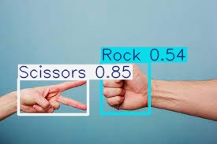

# Rock-Paper-Scissors Prediction with YOLO11

This project implements a Rock-Paper-Scissors hand gesture prediction model using YOLO11. Trained with high accuracy (99%), this model can detect and classify hand gestures (Rock, Paper, Scissors) in real-time using a camera feed. 




## Project Overview

The model is trained using the YOLO11 framework on a custom dataset of Rock-Paper-Scissors hand gestures. With real-time detection capabilities, this model can be used for live applications, enabling smooth gesture recognition.

### Features
- Real-time gesture recognition using a camera
- Detects three gestures: Rock, Paper, and Scissors
- Achieves high accuracy (99%) for reliable predictions

## Installation

1. **Clone the repository:**
   ```bash
   git clone https://github.com/alihassanml/Rcok-Seassor-Paper-Predict-Yolo11.git
   cd Rcok-Seassor-Paper-Predict-Yolo11
   ```

2. **Install required packages:**
   Make sure you have Python installed, then run:
   ```bash
   pip install -r requirements.txt
   ```

3. **Download or Add the Trained Model:**
   Place the `best.onnx` model file in the main directory. This model file can be created by training YOLO11 on your custom dataset.

## Usage

### Running the Live Prediction

To start the live prediction, run:

```bash
python app.py
```

This script uses OpenCV and your YOLO model to open the camera feed and start detecting gestures in real-time.

### Training Your Own Model

To train your model using YOLO11, follow these steps:

1. Prepare a dataset with annotated images of Rock, Paper, and Scissors gestures.
2. Use YOLO11's training pipeline:
   ```python
   from ultralytics import YOLO
   model = YOLO('yolo11.yaml')  # Adjust for YOLO11 model config
   model.train(data='data.yaml', epochs=100)  # Customize parameters as needed
   ```

3. Convert the trained model to `.onnx` format for inference:
   ```python
   model.export(format='onnx')
   ```

4. Replace the `best.onnx` file in this repository with your own trained model.

## Model Inference

The `app.py` script leverages YOLO11 to make predictions on live video, showing the gesture along with confidence scores. The system is optimized for a smooth user experience in gesture recognition.

## Results

The model achieves:
- **99% accuracy** on the test set
- Reliable real-time inference speed for camera-based applications

## Contributing

If you'd like to contribute, please fork the repository and use a feature branch. Pull requests are welcome!

## License

This project is licensed under the MIT License.
